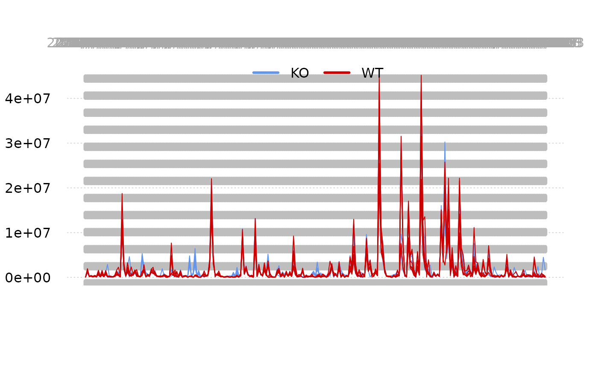
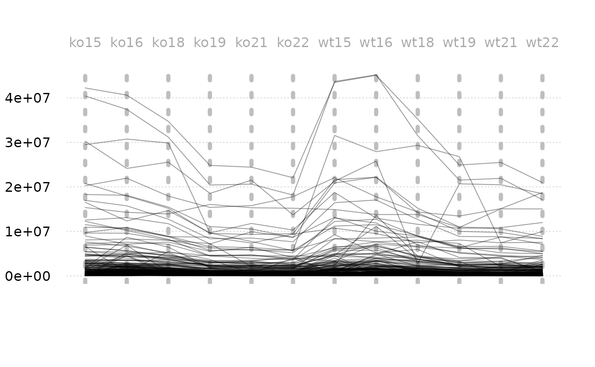
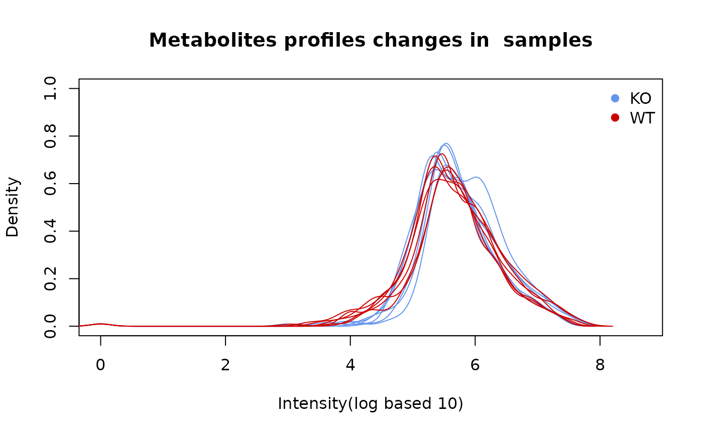
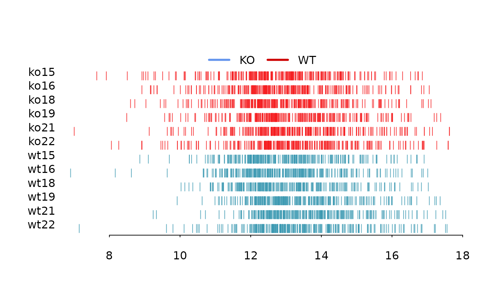
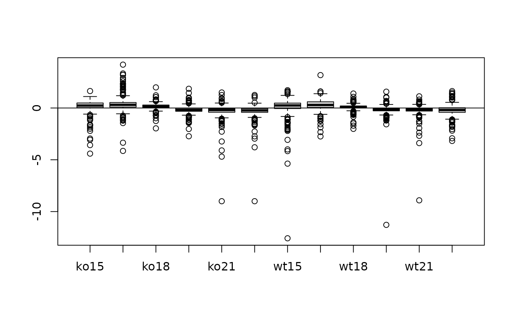
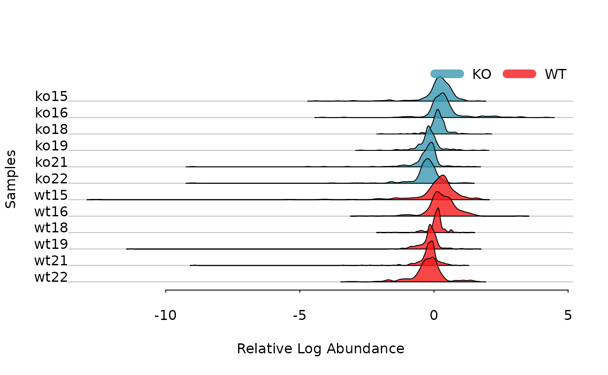
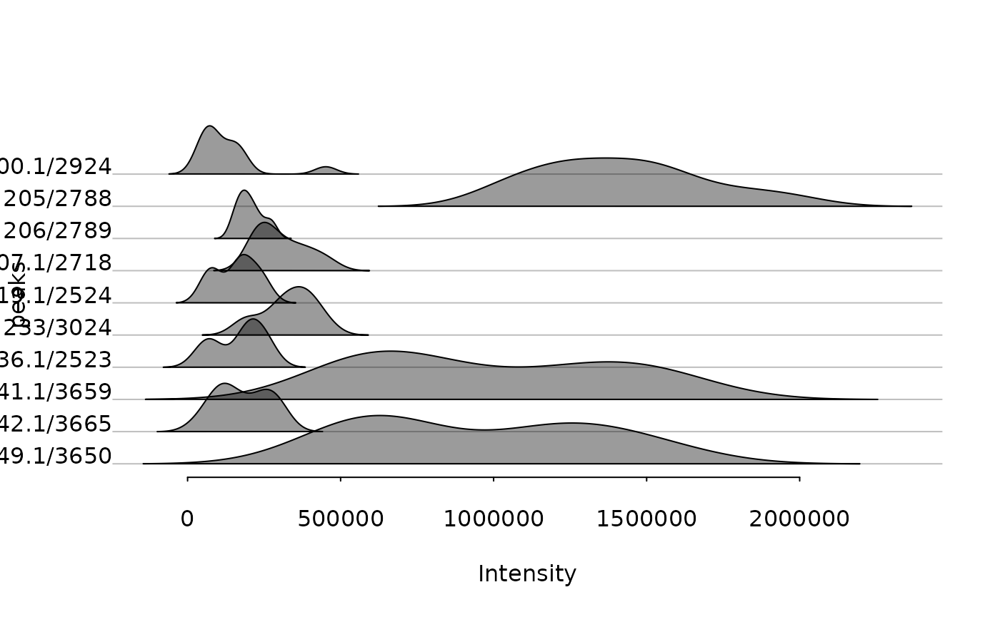
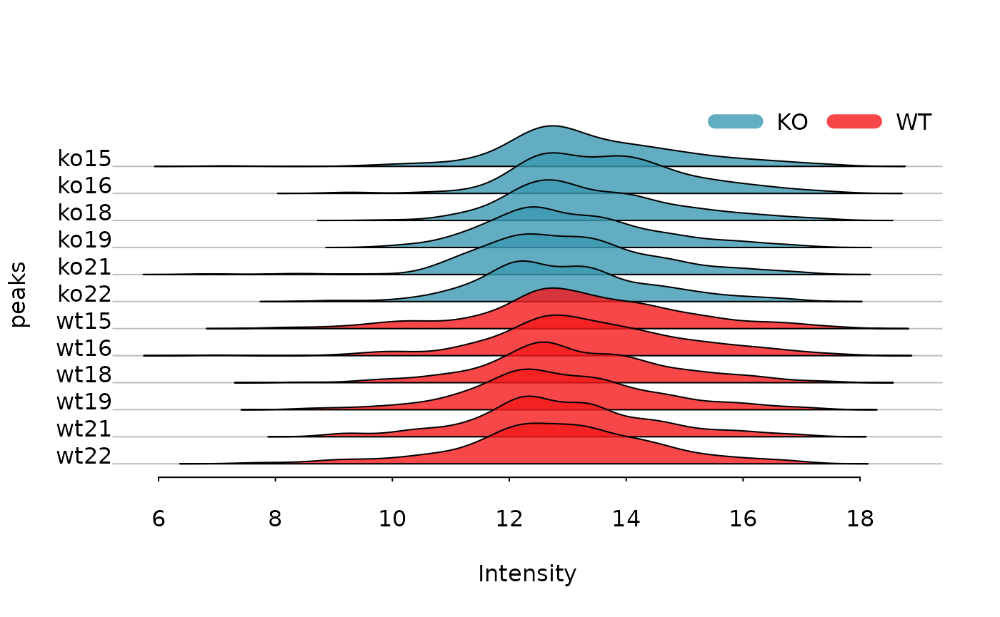
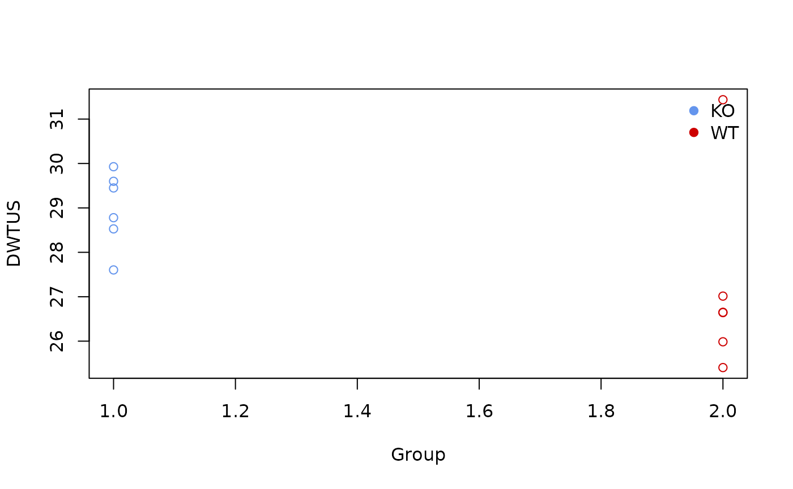

# Pooled QC analysis

``` r

library(enviGCMS)
```

Pooled QC samples within injection sequences are very important to
control the quality of untargeted analysis. I added some functions in
`enviGCMS` package to visualize or analysis Pooled QC samples or other
untargeted peaks profile.

## Peaks profile

We could check sample-wise changes of peaks.

``` r

plotpeak(list$data, lv = as.factor(list$group$sample_group))
```



Or peak-wise changes of samples.

``` r

plotpeak(t(list$data))
```



## Density distribution

For each sample, the peaks’ density distribution will tell us if certain
samples show large shift.

``` r

data(list)
plotden(list$data,list$group$sample_group,ylim = c(0,1))
```



``` r

# 1-d density for multiple samples
plotrug(log(list$data), lv = as.factor(list$group$sample_group))
```



## Relative Log Abundance (RLA) plots

Relative Log Abundance (RLA) plots could be another way to show the
intensity shift.

``` r

data(list)
plotrla(list$data,as.factor(list$group$sample_group))
```



## Relative Log Abundance Ridge (RLAR) plots

Relative Log Abundance Ridge (RLAR) plots could also be used to show the
intensity shift.

``` r

data(list)
plotridges(list$data, as.factor(list$group$sample_group))
```



``` r

# ridgeline density plot
plotridge(t(list$data),indexy=c(1:10),xlab = 'Intensity',ylab = 'peaks')
```



``` r

plotridge(log(list$data),as.factor(list$group$sample_group),xlab = 'Intensity',ylab = 'peaks')
```



## Density Weighted Total Usable Signal

The sum of all peaks’ intensity or total usable signal(TUS) could show
the general trends for each sample while peaks with lower ionization
energy will dominated such value. Here I introduced a density weighted
TUS to make the values robust to low frequency high intensity peaks. You
could use `getdwtus` to calculate DWTUS for samples.

``` math
DWTUS = \sum peak\ intensity * peak\ density
```

``` r

data(list)
apply(list$data,2,getdwtus)
#>     ko15     ko16     ko18     ko19     ko21     ko22     wt15     wt16 
#> 27.60340 29.92758 29.44948 28.77953 28.52748 29.59891 25.98583 26.64262 
#>     wt18     wt19     wt21     wt22 
#> 25.40499 27.01423 26.64988 31.43594
plotdwtus(list)
```



## Run order effect analysis

For LC/GC-MS analysis, the run order will affect the intensity of single
peak until the instrument is stable. The intensity will
decrease/increase with initial run order and researcher need to evaluate
how many samples are enough to eliminated run order effects. Here I
introduced a pooled QC linear index to show such trends in the sequence.


pqsi

As shown in above figure, for one peak repeated analyzed in one
sequence, the intensity would become stable in long term. In math, the
slope of every 5 samples along the run order would become 0. Then we
could define the percentage of stable peaks as pooled QC index. Such
index would be a value between 0 and 1. The higher of such index, more
peaks within the QC would be affected by run order effect. You could use
such function to check the QC samples to see if run order effects would
influence the samples at the beginning of sequences.

``` r

order <- 1:12
# n means how many points to build a linear regression model
n <- 5
idx <- getpqsi(list$data,order,n = n)
plot(idx~order[-(1:(n-1))],pch=19)
```


In this case, we could see at 5th sample, 30% peaks show correlation
with the run order. However, ever since 6th sample, the run order
effects could be ignore.
